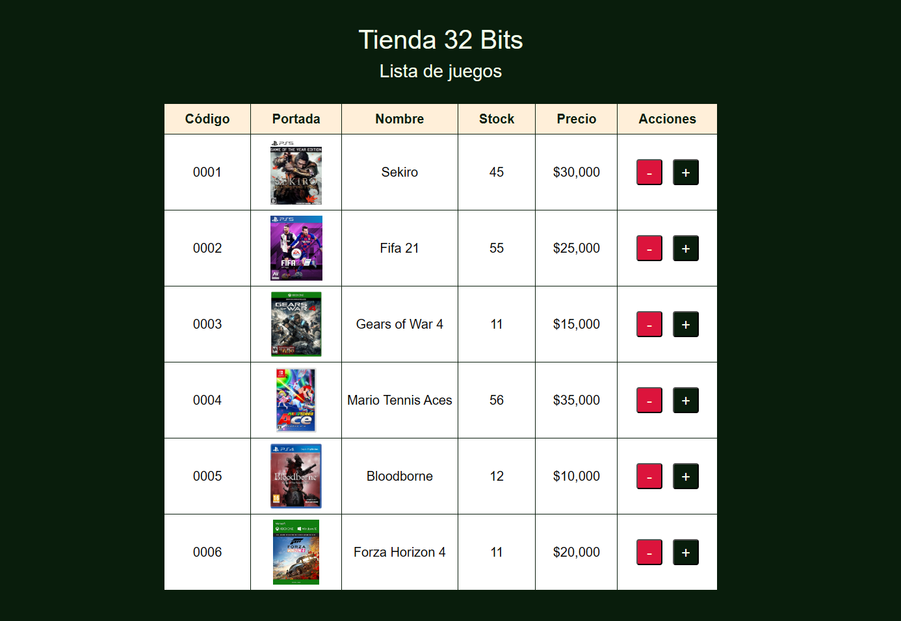

# vue-m7-vuex-tienda-32-bits



Desafío de código en el marco del desarrollo del bootcamp [**"Desarrollo de aplicaciones Frontend Vue 2.0"**](https://talentodigitalparachile.cl/curso/desarrollador-aplicaciones-front-end-trainee/) de Talento Digital. Corresponde al desafío evaluado de la unidad 2 "Vuex" del módulo 7 "Desarrollo de aplicaciones frontend con framework Vue".  

Es una aplicación que simula una tabla con información de stock de juegos para una posible tienda. Permite la interacción del usuario para manipular a través de botones el stock de una base de datos simulada sobre un archivo json. 

Las skills asociadas son aprender a instalar y usar Vuex usando algunas de sus características básicas para crear estados globales en la aplicación. Ver [desafío](./src/assets/utils/desafio.pdf)

## Levantando el proyecto: 
```sh
# 1. instalar dependencias
npm install

# 2. Levantar servidor en modo desarrollador
npm run serve
```

## Requisitos evaluados de la entrega

1. Crear proyecto con Vue CLI que incluya `Babel` y `Vuex` como únicas dependencias. **(1 punto)**
2. Alojar el JSON de juegos en el estado global de la aplicación. **(3 puntos)**
3. Utilizar `mapState` para el consumo de los juegos en el componente App. **(3 puntos)**
4. Utilizar `acciones` para modificar el stock de los videojuegos. **(3 puntos)**


## Implementación

1. Pasos: 
   1. Se crea el proyecto con `vue create nombre-proyecto` y se eligen las dependencias `Vuex` y `Babel`. 
   2. Luego se elige la versión 3.x de Vue para comenzar la creación del proyecto base.
2. Pasos: 
   1. Se descarga el apoyo del desafío que contiene el archivo `juegos.json` que simulará una base de datos
   2. Se copia este archivo en la carpeta [`/src/store`](./src/store/juegos.json) según lo aprendido en la guía.
   3. Para cargar los datos de `juegos.json` importaremos este en [`/src/store/index.js`](./src/store/index.js#L2) con la siguiente línea de código: `import juegos from './juegos.json'`
   4. Creamos una variable de estado global con la línea [`state: { juegos },`](./src/store/index.js#L6)
   5. Luego, en el mismo archivo usamos la propiedad [`mutations`](./src/store/index.js#L10) para cargar la data importada y asignarla a la variable `state.juegos`.
3. Pasos:
   1. Se importan los objetos `mapState` y `mapActions` en [`App.vue`](./src/App.vue#L30)
   2. Se usa [`mapState`](./src/App.vue#L35) para cargar el estado global en la instancia `App.vue`
   3. Se usa [`mapActions`](./src/App.vue#L38) para utilizar estos métodos que se crearán (o crearon) en `/src/store/index.js`
4. Pasos: en la propiedad `actions` creamos dos métodos,
   1. [`incrementar()`](./src/store/index.js#L16) para incrementar el valor de la propiedad "stock" de cada juego y,
   2. [`decrementar()`](./src/store/index.js#L21) para disminuir este mismo valor.

